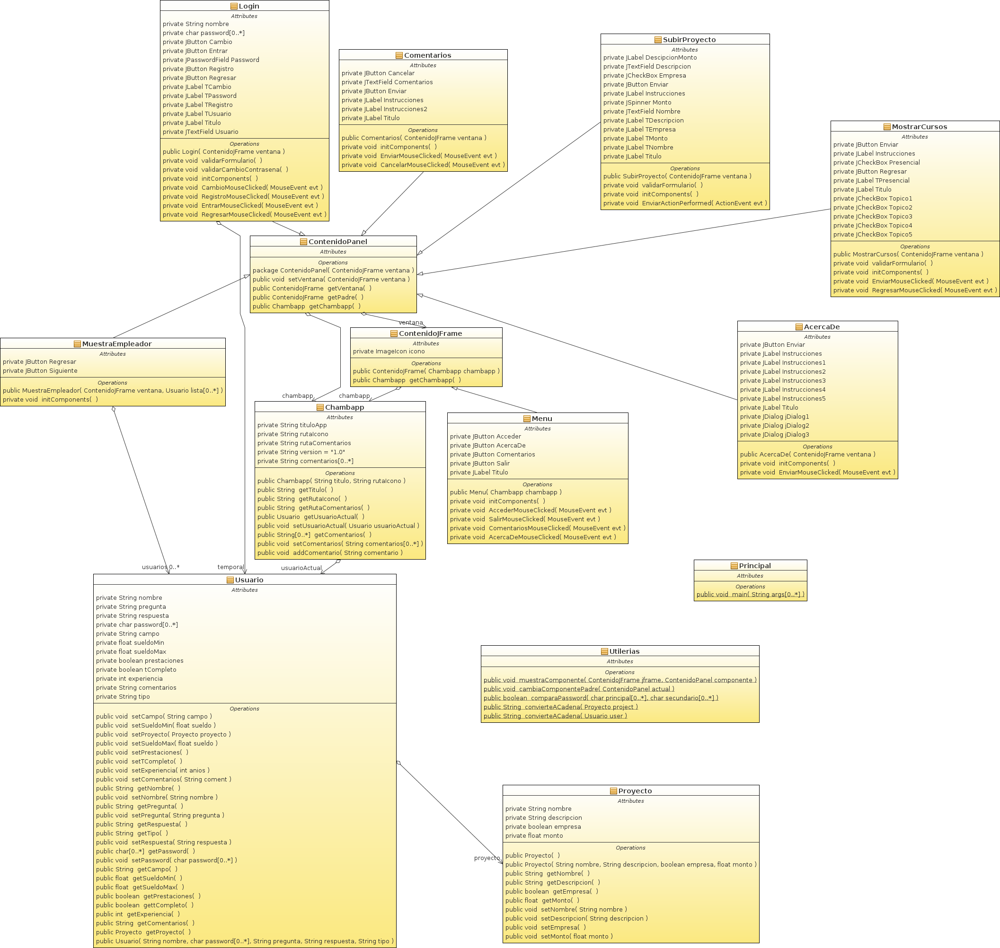

### Objetivo del juego/aplicación
ChambApp es una aplicación multiplataforma en la que sus usuarios pueden conseguir y dar trabajo entre si, además de desarrollar competencias y habilidades que complementen su desarrollo profesional dentro de la plataforma.

### Descripción del juego/aplicación
La aplicación tiene como fin el facilitar a sus usuarios, empleados y empleadores, la búsqueda y obtención de trabajo mediante una interfaz amigable. Se pretende que sea multilplataforma y que en cada una de ellas se proporcione un acceso rápido y sencillo.

### Links útiles
* [Descarga](https://github.com/acominf/ChambApp/releases)
* [Repositorio](https://github.com/acominf/ChambApp)

### Wiki Adicional
* [Capturas](Sitio/Capturas)

### Clases principales y sus características
1. Chambap
* Se encarga de administrar la app.
* Almacena una lista de usuarios.
* Se encarga de buscar informaciónen base a criterios específicos.

2. Usuario
* Se encarga de representar al usuario.
* Almacena/modifica la información personal.
* Permite interactuar con más usuarios.

3. Cursos
* Despliega las opciones de cursos disponibles.
* Permite al usuario tomar un curso.
* Retroalimentación a los usuarios que están participando en un curso.

### Diagrama de clases

### Autor(es)
El autor(es) del proyecto son:
- David Andrés Garza Medina (@davidazullo25)
- José Bernardo Bernal Cabrera (@Supermasterspark)

### Materia
- Programación Orientada a Objetos

### Semestre
- 2016-2017/II
