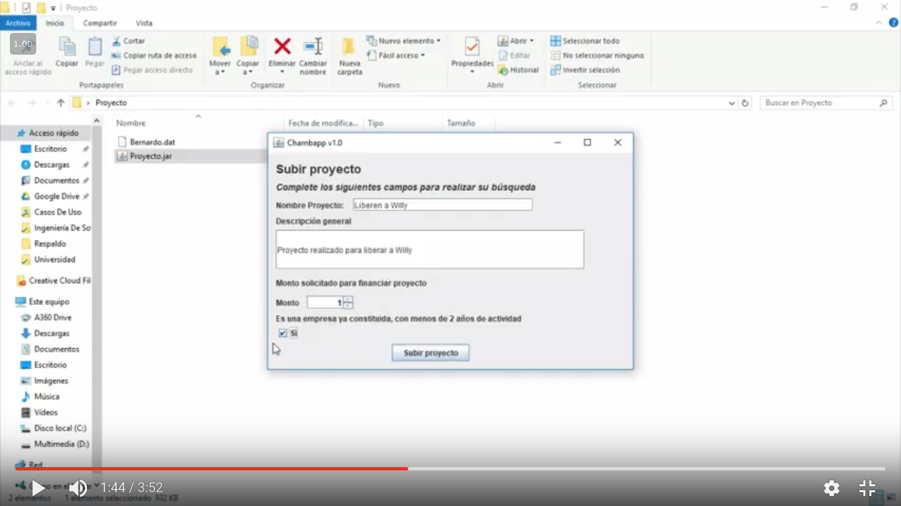

### Objetivo del juego/aplicación
ChambApp es una aplicación multiplataforma en la que sus usuarios pueden conseguir y dar trabajo entre si, además de desarrollar competencias y habilidades que complementen su desarrollo profesional dentro de la plataforma.

### Descripción del juego/aplicación
La aplicación tiene como fin el facilitar a sus usuarios, empleados y empleadores, la búsqueda y obtención de trabajo mediante una interfaz amigable. Se pretende que sea multilplataforma y que en cada una de ellas se proporcione un acceso rápido y sencillo.

### Wiki
* [Capturas](Sitio/Capturas)
* [Historias de Usuario](Sitio/Historias)
* [Diagramas de Clase](Sitio/Clases)

### Links útiles
* [Descarga](https://github.com/acominf/ChambApp/releases)
* [Repositorio](https://github.com/acominf/ChambApp)

### Introducción
Los sistemas computacionales que se desarrollan en la actualidad, surgen de las necesidades que se presentan, con el fin de hacer de nuestras actividades diarias un proceso más sencillo, así como para encontrar una posible solución óptima a diversos problemas de una manera más eficaz y en el menor tiempo posible. 

Actualmente uno de los problemas que requieren una solución inmediata es el desempleo, la falta de oportunidades para aquellas personas que carecen de una licenciatura o una especialidad en general es una situación que poco a poco daña la estabilidad social y económica.

ChambApp surge como una idea para reducir la tasa de desempleo y ofrecer alternativas de solución a los usuarios que decidan hacer uso de esta plataforma, para que, de esta forma pueda encontrar un empleo temporal que le ayude a solventar o enfrentar la difícil problemática que puede llegar a sufrir una persona desempleada.

### Propósito
El sistema otorga a los usuarios una forma de obtención de empleo, fácil, rápida, innovadora y confiable con el fin de reducir los índices de desempleo en las regiones donde se haga uso de la aplicación, además de ofrecer una herramienta para la creación y administración de proyectos y microempresas.

### Mercado
* Todas aquellas personas que quieran obtener un empleo temporal, que ayude a mejorar su situación económica.
* Personas que requieran algún servicio que pueda ser solventado por un empleado capacitado

### Modelo De Desarrollo De Software
#### Espiral
Es un modelo de proceso de software evolutivo que conjuga la naturaleza iterativa de construcción de prototipos con los aspectos controlados y sistemáticos del modelo lineal secuencial. Integra la fase del riesgo de software que no tiene consideración en otros métodos.

Se decidió usar este modelo de software debido a las fases que este plantea y que permite realizar un software de calidad.

* *Comunicación con el cliente*: Las tareas requeridas para establecer comunicación desarrollador-cliente.
* *Planificación y Análisis de Riesgo*: Tarea requeridas para evaluar riesgos, definir recursos, tiempo y costos.
* *Construcción e Ingeniería*: Construir prototipos, probar, instalar, soporte al usuario.
* *Evaluación del Cliente*: Obtener la reaccin del cliente según la evaluación del proyecto.

### Clases principales y sus características
1. Chambap
* Se encarga de administrar la app.
* Almacena una lista de usuarios.
* Se encarga de buscar informaciónen base a criterios específicos.

2. Usuario
* Se encarga de representar al usuario.
* Almacena/modifica la información personal.
* Permite interactuar con más usuarios.

3. Cursos
* Despliega las opciones de cursos disponibles.
* Permite al usuario tomar un curso.
* Retroalimentación a los usuarios que están participando en un curso.

### Diagrama de clases

### Autores
Los autores del proyecto son:
* David Andrés Garza Medina (@davidazullo25)
* José Bernardo Bernal Cabrera (@Supermasterspark)

### Materia
* Programación Orientada a Objetos

### Semestre
* 2016-2017/II
