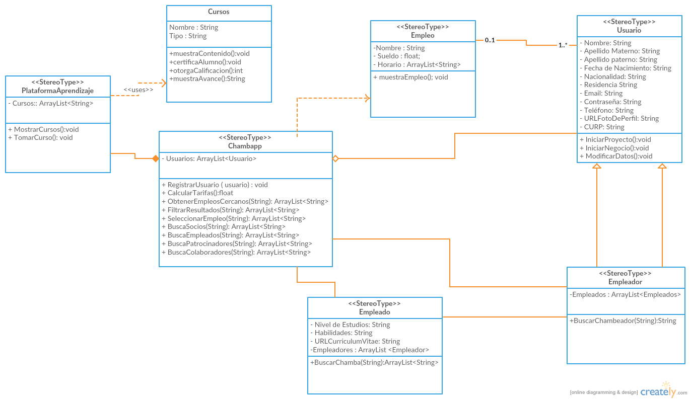

### Objetivo del juego/aplicación
ChambApp es una aplicación multiplataforma en la que sus usuarios pueden conseguir y dar trabajo entre si, además de desarrollar competencias y habilidades que complementen su desarrollo profesional dentro de la plataforma.

### Descripción del juego/aplicación

### Clases principales y sus características
1. Clase 1
* caracteristica1
* caracteristica2
* caracteristica3

2. Clase 2
* caracteristica1
* caracteristica2
* caracteristica3

3. Clase 3
* caracteristica1
* caracteristica2
* caracteristica3

4. Clase 4
* caracteristica1
* caracteristica2
* caracteristica3

5. Clase 5
* caracteristica1
* caracteristica2
* caracteristica3

### Diagrama de clases

### Autor(es)
El autor(es) del proyecto son:
- Jose Bernardo Bernal Cabrera (@Supermasterspark)
- David Andrés Garza Medina (@davidazullo25)

### Materia(s)
- Programación Orientada a Objetos

### Semestre
- 2016-2017/II

### Markdown
El contenido de esta página está escrito en un lenguaje de marcado sencillo llamado *Markdown*. Para más detalles consulta la página de [Markdown para GitHub](https://guides.github.com/features/mastering-markdown/).

### Temas de Jekyll
El estilo y presentación de esta página utiliza el tema de Jekyll seleccionado en la configuración del repositorio. El nombre de este tema está almacenado en el archivo de configuración `_config.yml`. Para más información acerca de los temas de Jekyll soportados por GitHub [haz click en este enlace](https://pages.github.com/themes/).
