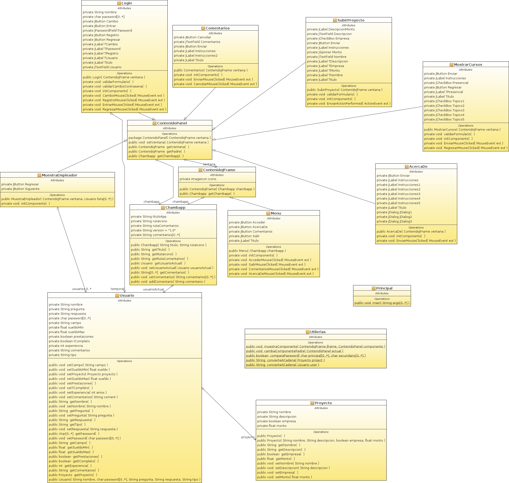
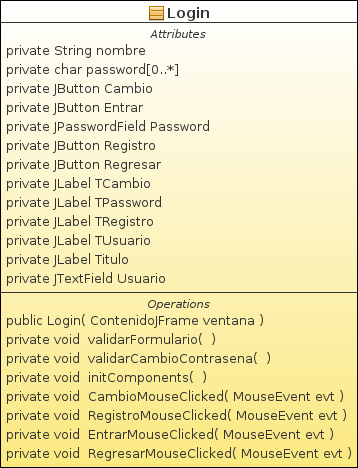

### Diagrama de Clases

### Clases principales y sus características
#### AcercaDe

#### Chambapp

#### Comentarios

#### ContenidoJFrame

#### ContenidoJPanel

#### Login

#### Menu

#### MostrarCursos

#### MuestraEmpleador

#### Principal

#### Proyecto

#### SubirProyecto

#### Usuario

#### Utilerias

[Regresar](..)